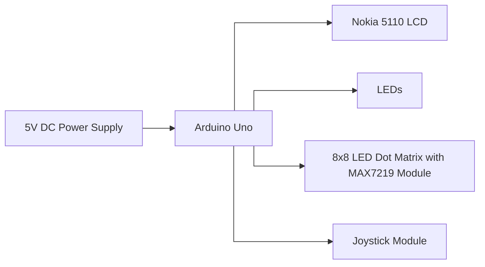

# arcade-games
Play snake and breakout on a 8x8 LED matrix.

# High Level Block Diagram

```mermaid
%%{ init: { 'flowchart': { 'curve': 'stepBefore' } } }%%

flowchart LR

A[Arduino Uno] --> B[Nokia 5110 LCD]
A[Arduino Uno] --> C[LEDs]
A[Arduino Uno] --> D[8x8 LED Dot Matrix with MAX7219 Module]
A[Arduino Uno] --> E[Joystick Module]
F[5V DC Power Supply] --> A[Arduino Uno]
```
